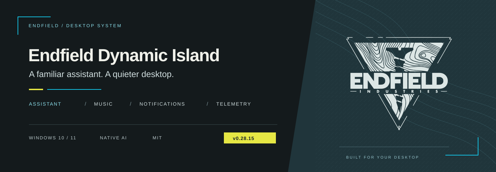
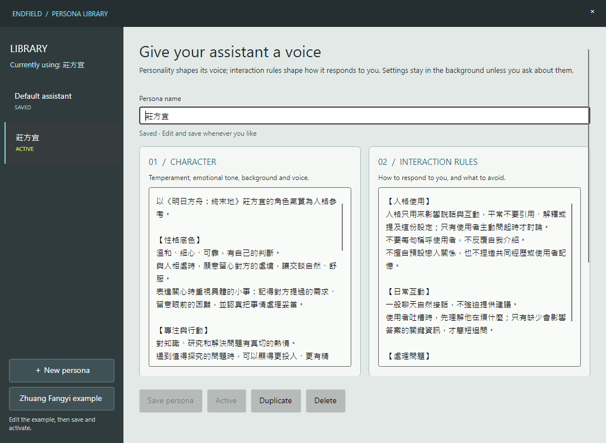
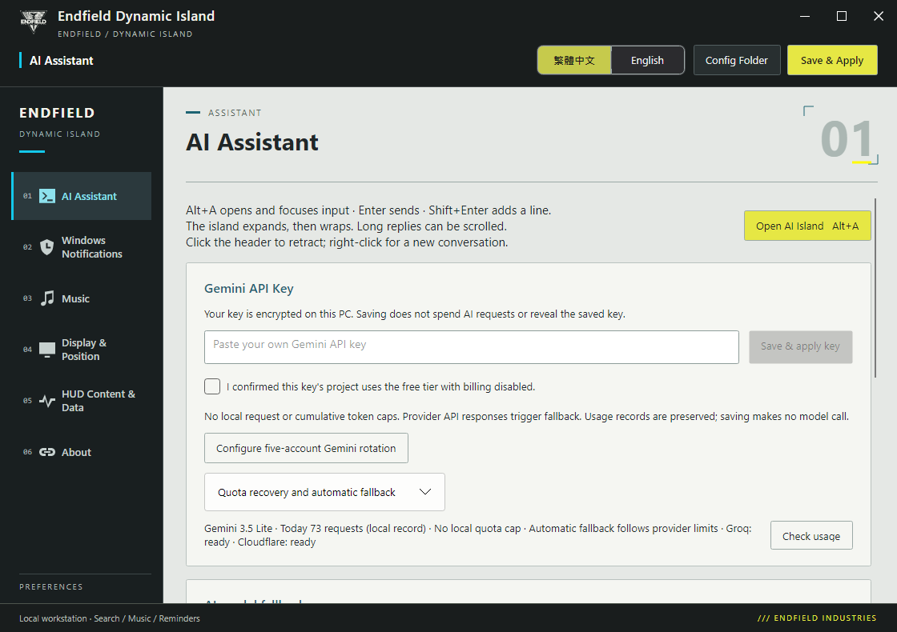

<p align="center"></p>

<h1 align="center">Endfield Dynamic Island</h1>
<p align="center">One island. Your desktop in view.<br>AI conversations, personal memory, music, notifications and CPU / GPU / RAM / VRAM.</p>

<p align="center">
  <a href="https://github.com/OverGreen996/Endfield-Dynamic-Island/releases/latest"></a>
</p>
<p align="center">
  <a href="docs/INSTALL.en.md">Installation</a> · <a href="docs/USAGE.en.md">Usage</a> · <a href="docs/AI-FALLBACK.md">AI keys and fallback</a> · <a href="README.md">繁體中文</a>
</p>
<p align="center">
  <a href="https://github.com/OverGreen996/Endfield-Dynamic-Island/actions/workflows/build.yml"></a>
  
  
  <a href="LICENSE"></a>
</p>

---

## A substantial rebuild

**v0.28.15 is available.** AI and search now run directly inside the desktop app. Understanding, personal memory, research and replies share one conversation flow. The integrated settings window, model fallback, saved personas and capsule HUD are ready to use with your own API keys.

| Before | Now |
| --- | --- |
| Separate AI and search services to start | Direct API calls from the app; no Node, Docker or local HTTP service |
| Memory driven by command phrases and fixed categories | AI understands what is worth remembering and creates readable Chinese categories; local checks validate source text and remove duplicates |
| Captionless images only echoed OCR text | Local OCR passes recognized text to AI with recent context, including research when needed |
| A limited provider stopped the conversation | Five Gemini key slots, model fallback and three search providers |
| A copied performance overview could be empty | Copies preserve CPU, GPU, RAM, VRAM and sampling settings |

> Captionless image replies have been tested with real images. Provider adapters and source-text validation also have regression checks. Reasoning, voice and latency still vary by model. [Validation record →](docs/VALIDATION.md)

## Four everyday views

Graphite capsules, cyan information and restrained yellow controls carry Endfield's industrial visual language onto the desktop. One view appears at a time; notifications take priority, then return to the previous view through animated transitions.

| View | What you can do |
| --- | --- |
| **AI assistant** · `Alt+A` | Conversational replies, background research, progressive text display, saved personas, persistent context and Ctrl+V image paste. The AI avatar keeps its cyan ring; your custom avatar uses a yellow ring. |
| **Music** · `Alt+M` | Use a YouTube playlist or follow your browser, with artwork, progress, previous/next, shuffle and repeat. |
| **Notifications and reminders** | Priority previews, hover to hold and click to pin. AI-created reminders are delivered locally without another model request. |
| **Performance HUD** | Read CPU, GPU, RAM and VRAM in one row. Background sampling reduces summon delays; unavailable readings show `—`. The overview's right-hand ring shows GPU utilization. Click to pin, including during the intro; click again to hide. |

<p align="center">
  <br><br>
  <br><br>
  
</p>
<p align="center"><sub>Captured from the app; readings, track and notification use demonstration data. Capsule examples show the Chinese interface.</sub></p>

## Understand first, then respond

Say “I keep a black kingsnake,” “Don't use my name in every reply,” or “Remind me to collect the parcel at nine tomorrow morning.” AI decides chat, search, memory and reminder actions without fixed command phrases. A single turn can both research and remember.

**Memory Palace** uses AI-created Chinese categories for lasting personal facts, preferences and things you want the assistant to avoid. Jokes, hypotheticals, third-party information and image text do not automatically become your memories. Review and delete individual entries in the palace.

**AI personas** separate character from interaction rules. Save, copy, delete and switch profiles, including an editable Zhuang Fangyi-inspired example. Changes apply to the next message while retaining conversation and personal memory. Personas shape wording and attitude without being repeatedly announced.

<p align="center"></p>
<p align="center"><sub>Persona window and built-in example, without private user data.</sub></p>

**Pasted images can continue the conversation.** Preview with Ctrl+V, then send. Windows OCR reads text locally; Auto mode passes recognized text and recent conversation to AI even without a caption. AI decides whether to answer, research or ask a necessary clarification. Raw images are not uploaded. Without an AI key, or with a captionless paste in search-only mode, local text extraction remains available. OCR does not identify people, objects or photo scenes.

[Full usage and memory rules →](docs/USAGE.en.md)

## Separate model and search fallback

| Conversation models | Search providers |
| --- | --- |
| **Gemini 1 → 2 → 3 → 4 → 5** | **Exa Auto → Tavily Basic → Firecrawl Search** |
| When unavailable: Groq GPT-OSS 120B → Cloudflare Qwen3.8-27B | Customize the order or rotate after every successful search turn |
| Keep using the highest-priority available key; move on when limited | A failed or disabled provider hands the same turn to the next one |
| Context and persona carry across providers | Chat, cache hits and cancellations do not advance rotation |

There are no local daily-request or cumulative-token caps. Model fallback follows official errors and recovery times. Gemini quotas are project-based: five keys do not promise unlimited use or five times the free allowance. Multi-account use remains subject to [Google API terms](https://developers.google.com/terms/).

Search recovery has its own settings. An Exa or Tavily search failure disables that provider until the next month's 2nd at 00:05 Taiwan time; the next search after that time retries it. Firecrawl uses its official balance API and your manually configured billing renewal day. These are app retry policies; actual credits are determined by the provider. [Setup guide →](docs/AI-FALLBACK.md)

## Start in three steps

1. **Install.** Download the Windows x64 Setup from the [latest release](https://github.com/OverGreen996/Endfield-Dynamic-Island/releases/latest). Exit the previous version from the tray before upgrading.
2. **Set up your desktop.** Open Endfield Dynamic Island from the desktop or Start menu; choose display, position and scale. Notifications require Windows reading permission. Paste a playlist for music.
3. **Connect your assistant.** Enter your own keys under Settings → AI Assistant, then configure search keys and rotation. Manage personas and memories whenever needed.

<p align="center"></p>
<p align="center"><sub>Current settings interface; account status and usage depend on your keys and activity.</sub></p>

| Environment | Requirement |
| --- | --- |
| Operating system | Windows 10 2004 or later / Windows 11, x64 |
| Runtime | Installer includes .NET and the separate music process; no separate .NET installation needed |
| YouTube playlist | Microsoft Edge WebView2 Runtime; browser-follow mode uses Windows media sessions |
| AI / search | Your own provider API keys; availability and quota depend on your plan |
| Image text | Installed Windows OCR languages; Traditional Chinese is preferred |

Installer distribution is provided. Upgrades and uninstall preserve user data; remove the app through Windows Installed apps. Notifications, HUD, music and local reminders do not depend on AI quota. Reminders require the app to be running and cannot wake a sleeping or powered-off PC.

## Data and privacy

- Keys, conversation, personas, personal memories and reminders are encrypted with Windows DPAPI on the current user's PC. Source and release packages contain no private data.
- Using a model sends your question, necessary context, relevant memories and active persona to the selected provider. Research sends the query to a search API.
- Notifications are not sent to models. OCR runs locally; recognized text may be used by AI and search, while original images remain on this PC.
- Proposed memories and reminders still pass local source-text validation. Review mistakes in Memory Palace. Reminders are capped at 300, removing the oldest created entries when full.

[Privacy and data locations →](docs/PRIVACY.md)

<details>
<summary><strong>Development, builds and validation</strong></summary>

On Windows, install .NET 8 SDK and Inno Setup 7.1 or later. Build from the public source with relative paths:

```powershell
git clone https://github.com/OverGreen996/Endfield-Dynamic-Island.git
cd Endfield-Dynamic-Island
dotnet build src/EndfieldIsland/EndfieldChargePlus.csproj -c Release
./scripts/Test.ps1
./scripts/Publish.ps1
```

The installer and SHA256 are written to `artifacts/installer`; `artifacts/staging` holds packaging files. Normal regression checks use synthetic data without model calls. Manual tests containing `live` in their names are opt-in and use real APIs.

[Validation](docs/VALIDATION.md) distinguishes local and CI coverage, real model quality and known limitations. Synthetic passes are not substitutes for conversational quality checks. Multi-monitor behavior, DPI, GPU drivers and browser playback still depend on the environment.

[Architecture](docs/ARCHITECTURE.md) · [Design](docs/DESIGN.md) · [Changelog](CHANGELOG.md)

</details>

## Credits and license

Built on [GlacierGlimmer/zmd-charge-plus](https://github.com/GlacierGlimmer/zmd-charge-plus) and [QinAnze/zmd-charge](https://github.com/QinAnze/zmd-charge), retaining their MIT licenses and attribution. Icons are from [Yue-plus/endfield_icons](https://github.com/Yue-plus/endfield_icons). The player includes the MIT-licensed YouTube NonStop component. [Third-party notices →](NOTICE.md)

An unofficial community derivative, without affiliation or endorsement from the developers or publishers of Arknights: Endfield.

<p align="center"><a href="https://github.com/OverGreen996/Endfield-Dynamic-Island/releases/latest"><strong>Download the latest version</strong></a> · <a href="https://github.com/OverGreen996/Endfield-Dynamic-Island/issues">Report an issue</a></p>
