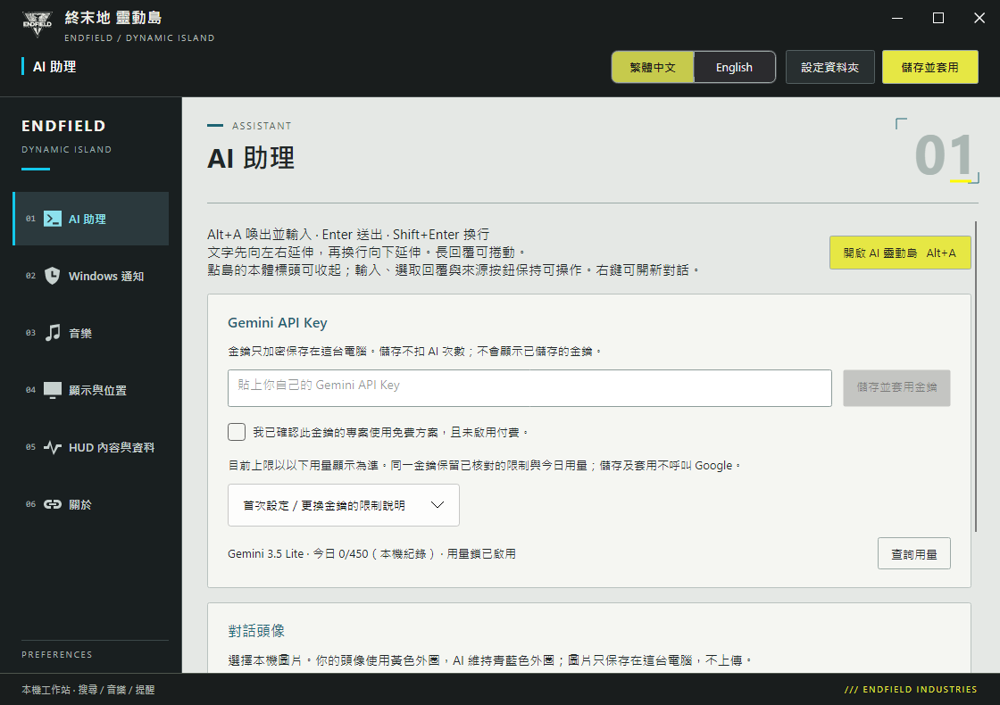

# Endfield Dynamic Island


A Windows desktop island for AI conversations, music, notifications and system telemetry. Graphite panels, cyan information and restrained yellow accents draw on Endfield's industrial visual language.

The settings window integrates its titlebar with indexed navigation, silver panels and clear section hierarchy. Both Chinese and English interfaces are supported. GPU sampling distinguishes missing counters from measured zero and isolates adapter LUIDs. [Design and validation](docs/SETTINGS-DESIGN.md).



v0.25.0 separates presentation from collection: local hardware profiles pre-sample about every 5 seconds while hidden and every second while visible. Summoning reads a shared cache without waiting for hardware. Settings previews reuse the same collector; AI, music and notifications open independently. Main app and music host remain separate processes while sharing installed .NET runtime files. Hidden prewarming never starts HTTP or ping probes.

[Download](https://github.com/OverGreen996/Endfield-Dynamic-Island/releases/latest) · [Installation guide](docs/INSTALL.en.md) · [Usage](docs/USAGE.en.md) · [繁體中文](README.md)

| Feature | Interaction |
| --- | --- |
| AI assistant | Alt+A focuses the composer. Natural conversational replies, progressive text display, persistent context and New conversation. |
| Music | Alt+M; artwork, progress, transport, shuffle and repeat. Dedicated YouTube playlist and browser-follow modes remain separate. |
| Notifications | Priority previews, hover hold, click to pin/hide, and animated return to the previous view. |
| Telemetry | CPU, GPU, RAM and VRAM in one capsule; unavailable readings are shown as `—`. |
| Personal assistant | Local reminders and categorized memories, including preferences and things the assistant should avoid. Individual memories can be deleted. |

## Install

The current source version is v0.28.14. Use its Windows installer when building locally; published downloads are the actual attachments on the Releases page. Exit the previous app from its tray menu and run Setup. It installs for the current user without administrator rights. Open from the desktop or Start menu; uninstall through Windows Installed apps. The executable and internal IDs retain their previous names for upgrade compatibility; the visible product name is Endfield Dynamic Island.

Setup includes the .NET runtime and music host. Upgrades and uninstall preserve user data. Portable packages are no longer distributed. YouTube playlist playback additionally requires Microsoft Edge WebView2 Runtime. Enable notification access in Settings. Add your own playlist; the distribution contains no personal playlist.

Text assistants prefer Gemini, then Groq GPT-OSS 120B, then Cloudflare Qwen3.8-27B. There are no app-enforced request or cumulative token quota caps; provider failures and reset information drive fallback. Configure encrypted backup credentials in Settings → AI Assistant. Windows OCR reads image text locally; raw images are not uploaded. [AI fallback setup](docs/AI-FALLBACK.md).

Search uses Exa Auto → Tavily Basic → Firecrawl Search. Open “Search APIs and rotation” from the assistant's context menu to enter your keys. Exa and Tavily have no local quota caps: a search API failure disables the affected provider until the 2nd of the next month at 00:05 Taiwan time, with fallback providers taking over until the next search retries that provider after that time. Firecrawl has no local credit cap; official API balances determine availability, with a manually configured renewal day and time. The model understands each question once; ordinary chat does not trigger web searches. AI and search execute inside the Island app, with no Node, PowerShell helper or loopback HTTP service. Daily Agent independently stores its own keys, limits, cache and cooldown state.

Chats, reminders and memories are encrypted for the current Windows user. This repository contains no keys, credentials, user conversations or local settings. Notifications are not sent to AI services. Reminders require the app to be running and do not wake a sleeping PC. Up to 300 reminders are retained, removing the oldest created item at capacity.

Search settings also offer optional per-turn provider rotation. Successful turns cycle through your chosen order, skipping unavailable providers. Cache hits, cancellations and ordinary chat do not advance rotation. Priority order remains the default. See [Usage](docs/USAGE.en.md).

## Build and test

The installer bundles the .NET runtime. AI and search adapters run natively in the main process using Windows SQLite and DPAPI; no Node or separate backend is required.

On Windows with .NET 8 SDK and Inno Setup 7.1 or newer:

```powershell
dotnet build src/EndfieldIsland/EndfieldChargePlus.csproj -c Release
./scripts/Test.ps1
./scripts/Publish.ps1
```

Regression tests use synthetic data and do not call model APIs. Physical multi-monitor/DPI behavior and provider playback vary by environment. Browser-follow shuffle/repeat depend on Windows media-session capabilities.

## Credits

Based on [GlacierGlimmer/zmd-charge-plus](https://github.com/GlacierGlimmer/zmd-charge-plus) and [QinAnze/zmd-charge](https://github.com/QinAnze/zmd-charge). Original MIT license and attribution are preserved. Icons: [Yue-plus/endfield_icons](https://github.com/Yue-plus/endfield_icons). See [NOTICE.md](NOTICE.md) for third-party licenses.

Unofficial community derivative; no affiliation or endorsement by the game developer/publisher. The header illustration is a brand/layout concept with illustrative readings.

### Personas and five Gemini primaries

Settings → AI Assistant → **Manage AI personas** separates personality from interaction rules. Save, then activate; add, duplicate or delete profiles. An editable Zhuang Fangyi-inspired assistant example is included. Switching applies to the next message without clearing history or personal memory.

**Configure five-account Gemini rotation** keeps slot 1 on the existing primary key and ledger. Add accounts 2–5. The app keeps using account 1 until unavailable, then 2, 3, 4 and 5; only then does Groq → Cloudflare take over. Higher-priority accounts return when their cooldowns expire. Selected context and persona continue across accounts. Google quotas are per project; multi-account use must comply with its [API terms](https://developers.google.com/terms/) and does not guarantee additional free quota.
