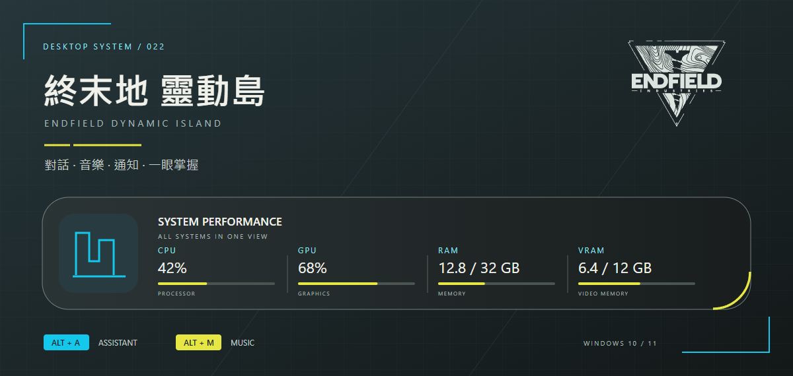

# Endfield Dynamic Island



A Windows desktop island for AI conversations, music, notifications and system telemetry. Graphite panels, cyan information and restrained yellow accents draw on Endfield's industrial visual language.

[Download](https://github.com/OverGreen996/Endfield-Dynamic-Island/releases/latest) · [繁體中文](README.md)

| Feature | Interaction |
| --- | --- |
| AI assistant | Alt+A focuses the composer. User messages on the right, AI on the left; persistent context, sources and New conversation. |
| Music | Alt+M; artwork, progress, transport, shuffle and repeat. Dedicated YouTube playlist and browser-follow modes remain separate. |
| Notifications | Priority previews, hover hold, click to pin/hide, and animated return to the previous view. |
| Telemetry | CPU, GPU, RAM and VRAM in one capsule; unavailable readings are shown as `—`. |
| Personal assistant | Local reminders and categorized memories, including preferences and things the assistant should avoid. Individual memories can be deleted. |

## Install

Download `Endfield-Dynamic-Island-Setup-v0.23.1-win-x64.exe` from Releases. Exit the previous app from its tray menu and run Setup. It installs for the current user without administrator rights. Open from the desktop or Start menu; uninstall through Windows Installed apps. The executable and internal IDs retain their previous names for upgrade compatibility; the visible product name is Endfield Dynamic Island.

Setup includes the .NET runtime and music host. Upgrades and uninstall preserve user data. Portable packages are no longer distributed. YouTube playlist playback additionally requires Microsoft Edge WebView2 Runtime. Enable notification access in Settings. Add your own playlist; the distribution contains no personal playlist.

**AI and XNG search require a separately deployed local Gemini Hub** at `127.0.0.1:8890`, including its local authentication and quota guard. It is not bundled here. Existing installations keep working; a fresh PC requires that service to be set up first. [XNG-Plugin](https://github.com/OverGreen996/XNG-Plugin) supplies the independent search core, but does not replace Gemini Hub. HUD, reminder, memory management and notification features can operate independently.

Chats, reminders and memories are encrypted for the current Windows user. This repository contains no keys, credentials, user conversations or local settings. Notifications are not sent to AI services. Reminders require the app to be running and do not wake a sleeping PC. Up to 300 reminders are retained, removing the oldest created item at capacity.

## Build and test

Ctrl+V pastes a removable image preview; only sending calls Gemini. Auto or Search + AI can research the identified subject through XNG. Images are not persisted, forwarded to XNG or used for memories. This is image understanding, not image generation. Gemini Hub 0.2.1 or newer is recommended for mandatory structured memory decisions; image input remains compatible with 0.2.0. Explicit original statements are validated locally; jokes, hypotheticals, third-party and sensitive details are not automatically saved. Classification shares the existing answer call.

On Windows with .NET 8 SDK and Inno Setup 7.1 or newer:

```powershell
dotnet build src/EndfieldIsland/EndfieldChargePlus.csproj -c Release
./scripts/Test.ps1
./scripts/Publish.ps1
```

Regression tests use synthetic data and do not call model APIs. Physical multi-monitor/DPI behavior and provider playback vary by environment. Browser-follow shuffle/repeat depend on Windows media-session capabilities.

## Credits

Based on [GlacierGlimmer/zmd-charge-plus](https://github.com/GlacierGlimmer/zmd-charge-plus) and [QinAnze/zmd-charge](https://github.com/QinAnze/zmd-charge). Original MIT license and attribution are preserved. Icons: [Yue-plus/endfield_icons](https://github.com/Yue-plus/endfield_icons). See [NOTICE.md](NOTICE.md) for third-party licenses.

Unofficial community derivative; no affiliation or endorsement by the game developer/publisher. The header illustration is a brand/layout concept with illustrative readings.
