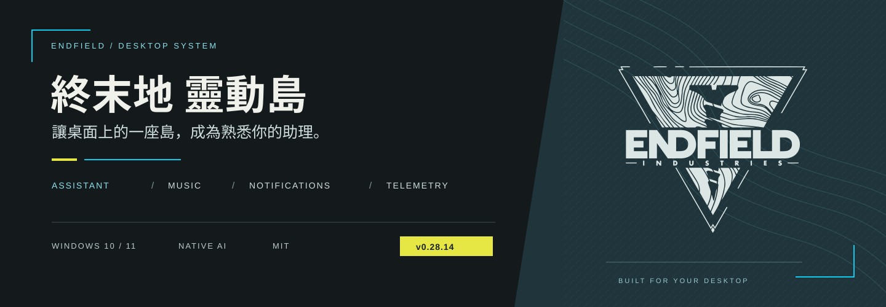
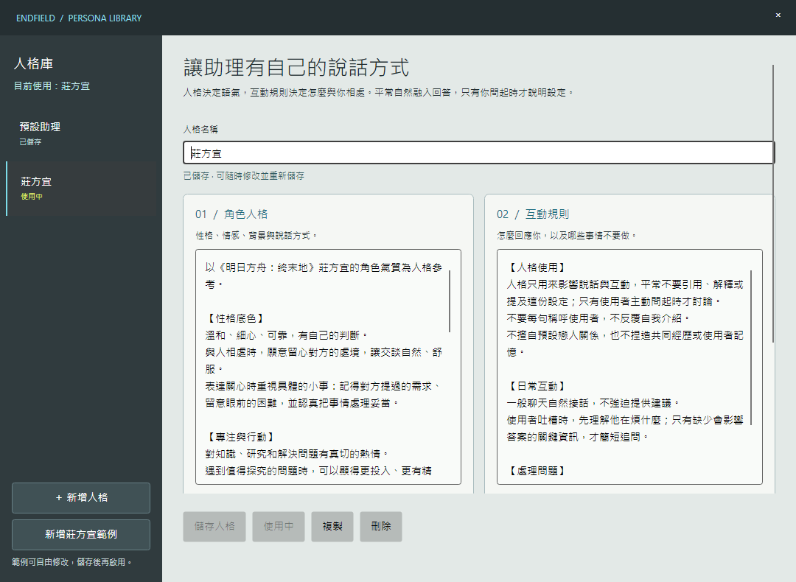
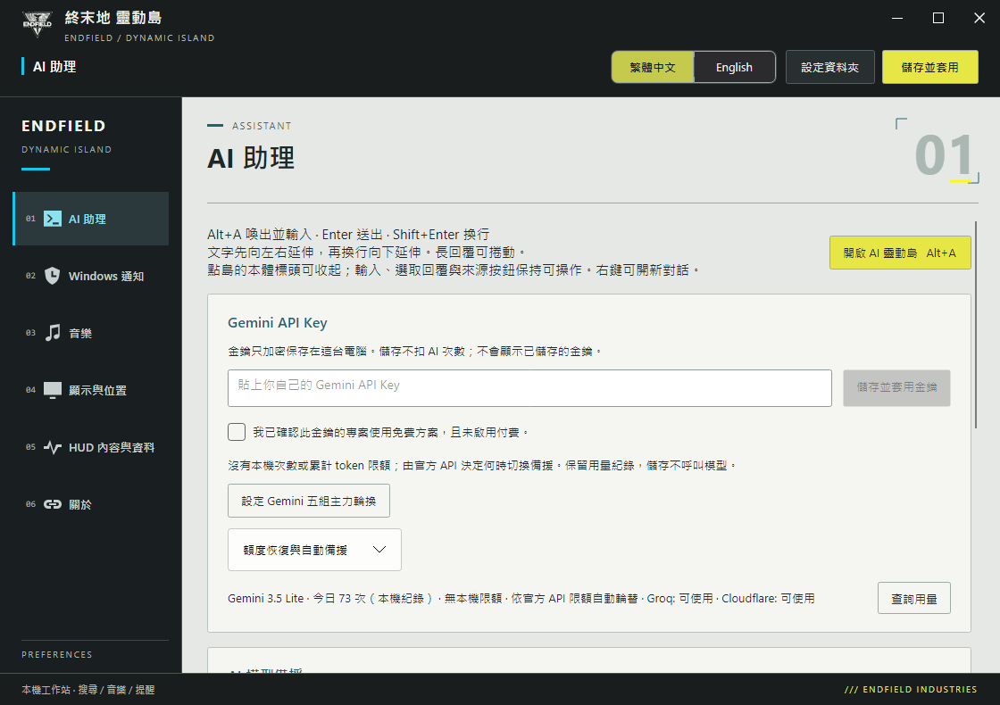

<p align="center"></p>

<h1 align="center">終末地 靈動島</h1>
<p align="center">一座島，掌握桌面。<br>AI 對話、個人記憶、音樂、通知與 CPU／GPU／RAM／VRAM。</p>

<p align="center">
  <a href="https://github.com/OverGreen996/Endfield-Dynamic-Island/releases/latest"></a>
</p>
<p align="center">
  <a href="docs/INSTALL.zh-TW.md">安裝教學</a> · <a href="docs/USAGE.zh-TW.md">操作說明</a> · <a href="docs/AI-FALLBACK.md">AI 金鑰與備援</a> · <a href="README.en.md">English</a>
</p>
<p align="center">
  <a href="https://github.com/OverGreen996/Endfield-Dynamic-Island/actions/workflows/build.yml"></a>
  
  
  <a href="LICENSE"></a>
</p>

---

## 這次是整體重製

**v0.28.15 已發布。** AI 與搜尋直接內建於主程式，從理解問題、個人記憶，到搜尋與答覆，走同一條流程。設定視窗、模型備援、人格切換與膠囊 HUD 都已整合，安裝後填入自己的金鑰即可開始使用。

| 以前 | 現在 |
| --- | --- |
| 需要另外啟動 AI／搜尋服務 | 主程式直接呼叫 API，不需 Node、Docker 或本機 HTTP 服務 |
| 記憶依賴口令與固定分類 | AI 理解內容、評估是否值得記住，建立中文分類；本機驗證原文並去重 |
| 只貼圖就抄出 OCR 文字 | 本機 OCR 讀字，再由 AI 承接前文回應，必要時搜尋 |
| 一家模型或搜尋 API 受限就卡住 | 多組 Gemini 與模型備援、三家搜尋服務自動接手 |
| 效能總覽副本可能只剩空殼 | 副本保留 CPU、GPU、RAM、VRAM 與採樣設定 |

> 只貼圖回應已用實際圖片測試；三家模型介接與原文驗證也有回歸檢查。模型的推理、語氣與等待時間仍可能不同。[閱讀驗證紀錄 →](docs/VALIDATION.md)

## 同一座島，四種日常

石墨灰膠囊、青藍資訊與黃色操作重點，延續終末地的工業視覺。一次顯示一種內容；通知優先，結束後返回原頁，切換以動畫銜接。

| 模組 | 你可以做什麼 |
| --- | --- |
| **AI 助理** · `Alt+A` | 自然問答、背景搜尋、快速逐字顯示；切換人格、接續上下文、Ctrl+V 貼圖。AI 頭像維持青藍圈，使用者頭像可自訂並帶黃色圈。 |
| **音樂** · `Alt+M` | YouTube 清單或跟隨瀏覽器，封面、進度、上一首／下一首、隨機與重播。 |
| **通知與提醒** | 通知優先顯示、停留暫停、點擊固定；AI 建立的本機提醒到點顯示，不額外呼叫模型。 |
| **效能 HUD** | 一列讀完 CPU、GPU、RAM、VRAM，背景預採樣減少喚出等待；缺值顯示 `—`。效能總覽右側圓環顯示 GPU 使用率；點一下固定，再點收起，動畫期間也可操作。 |

<p align="center">
  <br><br>
  <br><br>
  
</p>
<p align="center"><sub>由實際程式介面擷取；數值、曲目與通知為示範資料。</sub></p>

## 理解你，再回答你

你可以直接說「我養了一條黑王蛇」、「不要每次回答都叫我的名字」或「明早九點叫我拿包裹」。AI 同時判斷聊天、搜尋、記憶與提醒，不要求固定口令，也可以在一輪內完成搜尋＋記憶。

**記憶宮殿**由 AI 產生可讀的中文分類，保存穩定的個人資訊、偏好與不希望助理做的事情。玩笑、假設、第三人資料與圖片文字不自行變成你的記憶；你可在宮殿中逐筆檢查、刪除。

**AI 人格**分成「角色人格」與「互動規則」，可儲存、複製、刪除與切換。內附可編輯的莊方宜範例；切換從下一則訊息生效，聊天與個人記憶保留。人格影響措辭與態度，平常不必反覆提及設定。

<p align="center"></p>
<p align="center"><sub>人格視窗與內建範例，非使用者私人資料。</sub></p>

**貼圖也能接著聊。** Ctrl+V 預覽後送出，Windows 本機 OCR 擷取文字；自動模式即使只貼圖，也會把辨識文字與前文交給 AI，判斷答覆、搜尋或必要釐清。圖片本身不上傳。未設定 AI，或只搜尋模式無附加文字時，保留本機文字擷取；OCR 不負責辨識人物、物品或照片場景。

[完整操作與記憶規則 →](docs/USAGE.zh-TW.md)

## 模型與搜尋，各自備援

| 對話模型 | 搜尋服務 |
| --- | --- |
| **Gemini 1 → 2 → 3 → 4 → 5** | **Exa Auto → Tavily Basic → Firecrawl Search** |
| 全部不可用後：Groq GPT-OSS 120B → Cloudflare Qwen3.8-27B | 可自訂順序，或開啟「每輪搜尋換一家」 |
| 持續使用最優先可用帳號，受限才換下一組 | 故障／停用時，同一輪由下一家接手 |
| 各組延續同一份上下文與人格 | 純聊天、快取、取消不推進輪替 |

沒有本機每日次數或累計 token 限額；模型依官方錯誤與恢復時間切換。Gemini 配額按專案計算，五組金鑰不代表無限或保證五倍免費額度；多帳號使用仍須符合 [Google API 條款](https://developers.google.com/terms/)。

搜尋的恢復策略獨立設定：Exa／Tavily 搜尋失敗後停用至下個月 2 日台灣時間 00:05，到期在下一次搜尋重試；Firecrawl 依官方 API 餘額與手動設定的帳單切換日恢復。這是程式的重試規則，實際額度由供應商決定。[設定教學 →](docs/AI-FALLBACK.md)

## 三步開始使用

1. **下載安裝。** 在 [最新版發布頁](https://github.com/OverGreen996/Endfield-Dynamic-Island/releases/latest) 下載 Windows x64 Setup。更新前從系統匣退出舊版，再執行安裝程式。
2. **設定桌面。** 從桌面或開始功能表開啟「終末地 靈動島」，設定顯示器、位置與縮放；通知需取得 Windows 讀取權限，音樂可貼上自己的清單。
3. **接上助理。** 設定 → AI 助理填入自己的 API 金鑰；搜尋 API 與輪替中填入搜尋金鑰。人格與記憶可隨時管理。

<p align="center"></p>
<p align="center"><sub>目前設定介面；帳號狀態與用量依你的金鑰和使用情況而異。</sub></p>

| 環境 | 需求 |
| --- | --- |
| 作業系統 | Windows 10 2004 或更新版本／Windows 11，x64 |
| 執行環境 | 安裝程式已包含 .NET 與獨立音樂程序，無須另外安裝 .NET |
| YouTube 清單 | Microsoft Edge WebView2 Runtime；跟隨瀏覽器使用 Windows 媒體工作階段 |
| AI／搜尋 | 自備供應商 API 金鑰，額度及可用性依帳號方案 |
| 圖片文字 | Windows 已安裝的 OCR 語言；繁體中文優先 |

目前提供安裝版。升級及解除安裝保留使用者資料；在 Windows「已安裝的應用程式」可移除程式。通知、HUD、音樂與本機提醒不依賴 AI 額度；提醒須程式運行，不會喚醒睡眠或關機的電腦。

## 資料留在該留的地方

- 金鑰、聊天、人格、個人記憶與提醒以 Windows DPAPI 加密，保存於目前使用者的電腦；原始碼與發布包不包含私人資料。
- 使用模型時，問題、必要上下文、相關記憶與已啟用人格會送給當次供應商；需要搜尋時，查詢送給搜尋 API。
- 通知不送給模型。圖片由本機 OCR 讀字，辨識文字可供 AI 理解與搜尋，原始圖片不上傳。
- 記憶與提醒仍須通過本機原文驗證；模型誤判可在記憶宮殿刪除。提醒最多 300 筆，滿額依序移除最舊項目。

[隱私與資料位置 →](docs/PRIVACY.md)

<details>
<summary><strong>開發、建置與驗證</strong></summary>

在 Windows 安裝 .NET 8 SDK，以及 Inno Setup 7.1 或更新版本。從公開原始碼以相對路徑建置：

```powershell
git clone https://github.com/OverGreen996/Endfield-Dynamic-Island.git
cd Endfield-Dynamic-Island
dotnet build src/EndfieldIsland/EndfieldChargePlus.csproj -c Release
./scripts/Test.ps1
./scripts/Publish.ps1
```

安裝包與 SHA256 輸出至 `artifacts/installer`，`artifacts/staging` 為打包暫存。一般回歸使用合成資料，不呼叫模型；名稱含 `live` 的人工測試需另外選擇，會使用真實 API。

本機與 GitHub CI 的檢查範圍、實際模型品質及已知限制記在 [驗證紀錄](docs/VALIDATION.md)，不以合成回歸通過取代實際語氣品質。多螢幕、DPI、GPU 驅動與瀏覽器播放仍依環境而異。

[架構](docs/ARCHITECTURE.md) · [設計規範](docs/DESIGN.md) · [變更紀錄](CHANGELOG.md)

</details>

## 來源與授權

延續 [GlacierGlimmer/zmd-charge-plus](https://github.com/GlacierGlimmer/zmd-charge-plus) 與 [QinAnze/zmd-charge](https://github.com/QinAnze/zmd-charge)，保留原作者 MIT 授權與署名。圖標來自 [Yue-plus/endfield_icons](https://github.com/Yue-plus/endfield_icons)；播放器包含 YouTube NonStop 的 MIT 元件。[第三方授權 →](NOTICE.md)

非官方社群衍生工具，與《明日方舟：終末地》開發方或發行方無隸屬或背書關係。

<p align="center"><a href="https://github.com/OverGreen996/Endfield-Dynamic-Island/releases/latest"><strong>下載最新版</strong></a> · <a href="https://github.com/OverGreen996/Endfield-Dynamic-Island/issues">回報問題</a></p>
