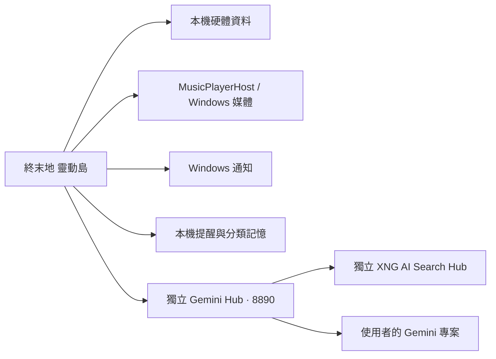

# 模組與相容性

`src/EndfieldIsland` 是 Avalonia 前端；`src/MusicPlayerHost` 是背景 WebView2 原頁播放器。搜尋算法、證據排序與 Gemini 用量控制由共用後端維護，不複製到各個 UI。

AI 前端依賴 Gemini Hub 的 `/assistant`、`/usage`、`/xng/status` 及本機 Bearer 驗證。Hub 固定本機 8890；狀態辨識與 XNG 自訂安裝由 Hub 負責。[integrations/gemini-hub](../integrations/gemini-hub) 提供獨立後端原始碼及部署教學；Setup 安裝共用 Hub 與 Node 到 Windows 文件的 ChatGPT/GeminiHub；不配送任何金鑰、政策或私人資料，執行時也不依賴此 Git 工作目錄。部署到自己的服務目錄後，移除靈動島不影響 Hub/XNG。一般 HUD 與個人提醒不需要呼叫模型。

Hub 0.4.0 的 auto/search 文字請求先由 Gemini 理解意圖與上下文，形成公开查詢，再由既有 XNG 提供證據。普通聊天直接於第一輪回答；搜尋通常再用一輪 Gemini 整理。chat/web明確模式保留。時效問題強制查證，缺必要名稱先釐清；來源不足不補成最新事實。這是共用助手調度，沒有修改 XNG 搜尋算法或將其複製到前端。

為維持升級相容，保留 `EndfieldChargePlus` 命名空間、EXE、互斥鎖、開機啟動識別與資料目錄。Windows Setup 使用固定 AppId，程式放在每使用者安裝目錄；升級及解除安裝不刪除個人資料。個人資料不會搬到 Git 工作目錄。

Ctrl+V 圖片僅在記憶體預覽；送出才交給 Hub 判讀，必要時由 Hub 接 XNG。對話只保存附圖佔位文字。Hub 可在既有回答提出個人原句分類；前端再核對分類、原句與本機保存規則；明確稱呼偏好可直接保存，單獨「記住」只核對上一個使用者原句，成功保存後才顯示確認。圖片內容不進入個人記憶。

通知輪詢一次處理完成才開始下一次；四項效能讀值共用資料提供者。視窗外緣依實際繪製 alpha 計算互動區域，縮放或尺寸變化才重算。

## v0.25.0 顯示與採樣分離

`CustomHudRuntime` 管理顯示狀態與動畫；`HudDataService` 管理有界快取及單一序列化採樣；`VariableHub` 保留既有硬體提供者。HUD 與設定預覽讀取同一份服務，顯示時不等待 WMI／GPU／網路。尚未取得或超過 8 秒的硬體快照不顯示為有效讀值；時鐘直接更新。

目前硬體方案在可見時約每秒採樣，隱藏或切到 AI／音樂時約每 5 秒預採樣。只預採樣 CPU／GPU／記憶體與時鐘的本機方案；時鐘單獨顯示不採硬體，混入 HTTP、Ping 或其他提供者的方案不做隱藏預抓。採樣慢時不疊加工作；同一快照請求合併，至多保存 8 個設定範圍。切換頁面不會中止共享採樣，退出程式會停止排程並釋放提供者。睡眠期間不喚醒電腦。

硬體枚舉於背景執行；一般 HUD 的進入動畫使用既有短膠囊動畫，完整電源演出保留。AI、音樂與通知的視窗不等待硬體，晚到數據不能重新叫出已收起的 HUD。

`EndfieldChargePlus.exe` 與 `MusicPlayerHost.exe` 仍是兩個程序，播放模式與資料保持隔離；安裝檔將相同 .NET 檔放在同一目錄以避免重複配送。舊版巢狀播放器位置仍可讀取。從舊安裝升級可能保留原巢狀 runtime，不把新安裝節省的磁碟容量當成升級後一定釋放的容量。
