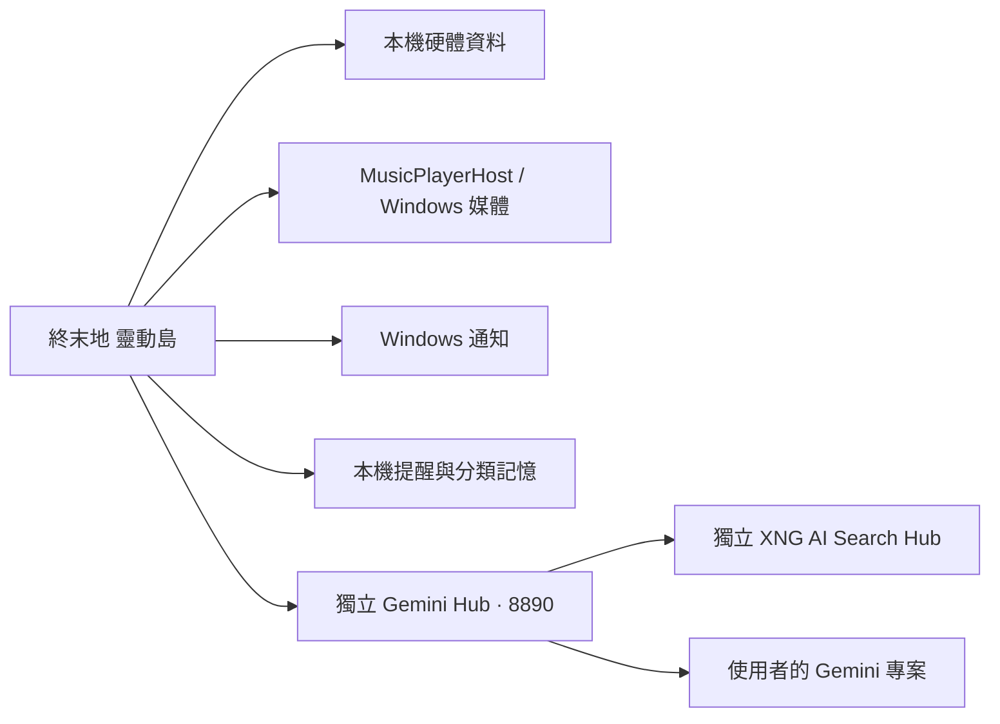

# 模組與相容性

`src/EndfieldIsland` 是 Avalonia 前端；`src/MusicPlayerHost` 是背景 WebView2 原頁播放器。搜尋算法、證據排序與 Gemini 用量控制由共用後端維護，不複製到各個 UI。

AI 前端目前依賴 Gemini Hub 的 `/assistant`、`/usage`、`/xng/status` 及本機 Bearer 驗證。Hub 固定本機 8890；狀態辨識與 XNG 自訂安裝由 Hub 負責。此儲存庫只包含使用端，沒有配送 Hub。一般 HUD 與個人提醒不需要呼叫模型。

為維持升級相容，保留 `EndfieldChargePlus` 命名空間、EXE、互斥鎖、開機啟動識別與資料目錄。變更只統一可見品牌與更新來源。個人資料不會搬到 Git 工作目錄。

通知輪詢一次處理完成才開始下一次；四項效能讀值共用資料提供者。視窗外緣依實際繪製 alpha 計算互動區域，縮放或尺寸變化才重算。
